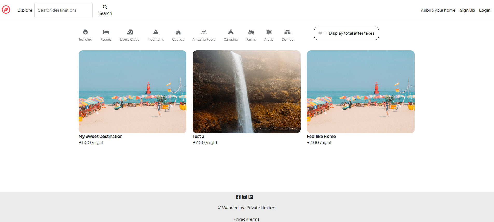
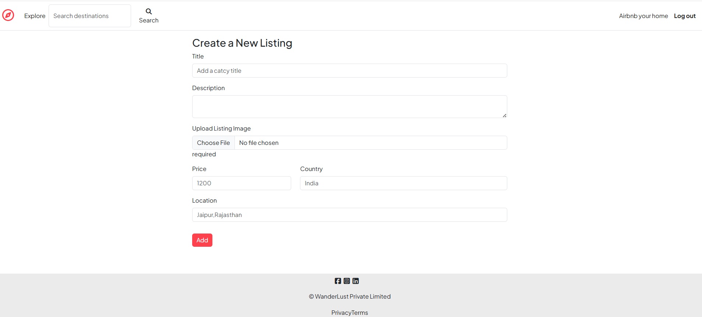
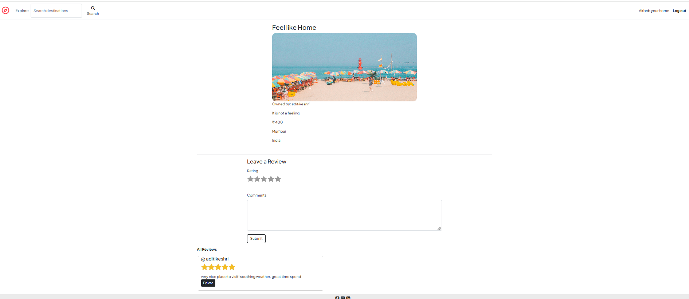
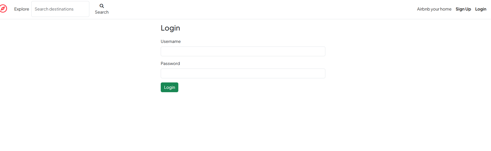

# Wanderlust

Wanderlust is a full-stack travel listing web application inspired by Airbnb, where users can explore destinations, create property listings, upload images, and share reviews. The platform provides secure authentication, seamless CRUD operations, responsive UI, and cloud-based image management.

---

## Features

- User Authentication & Authorization
- Create, Edit, and Delete Listings
- Upload Listing Images using Cloudinary
- Add Reviews and Ratings
- Flash Messages and Custom Error Handling
- RESTful Routing
- Responsive User Interface
- MongoDB Atlas Database Integration

---

## Tech Stack

### Frontend
- HTML5
- CSS3
- Bootstrap
- EJS

### Backend
- Node.js
- Express.js

### Database
- MongoDB Atlas
- Mongoose

### Authentication
- Passport.js
- Passport Local

### Cloud Storage
- Cloudinary
- Multer

---

## Installation and Setup

### Clone the Repository

```bash
git clone https://github.com/aditikeshri/wander_lust-project.git
```

### Navigate to Project Directory

```bash
cd wanderlust
```

### Install Dependencies

```bash
npm install
```

### Configure Environment Variables

Create a `.env` file in the root directory and add:

```env
ATLASDB_URL=your_mongodb_connection_string
SECRET=your_secret_key

CLOUD_NAME=your_cloudinary_cloud_name
CLOUD_API_KEY=your_cloudinary_api_key
CLOUD_API_SECRET=your_cloudinary_api_secret
```

### Start the Application

```bash
nodemon app.js
```

or

```bash
node app.js
```

### Open in Browser

```bash
http://localhost:8080
```

---

## Project Structure

```bash
wanderlust/
│
├── controllers/
├── models/
├── routes/
├── views/
├── public/
├── utils/
├── middleware.js
├── cloudConfig.js
├── app.js
├── package.json
└── README.md
```

---

## Screenshots

### Homepage



### Add Listing Page



### Edit Listing Page



### Login Page



---

## Key Functionalities

### Authentication
- Secure user signup and login using Passport.js

### Listings
- Create, edit, and delete travel listings
- Upload images using Cloudinary

### Reviews
- Add and delete reviews securely

### Error Handling
- Custom Express error handling middleware
- Flash notifications for user feedback

---

## Future Enhancements

- Search and Filter Functionality
- Booking System
- Payment Gateway Integration
- Interactive Maps
- Wishlist Feature
- User Dashboard

---

## Author

Aditi Keshri

---

## License

This project is developed for educational and learning purposes.
